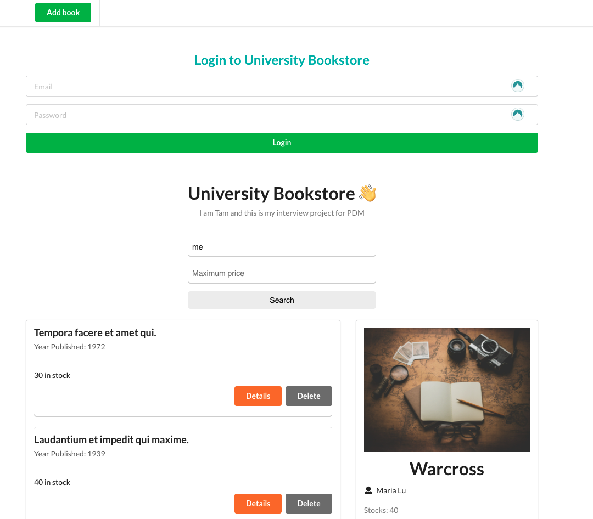
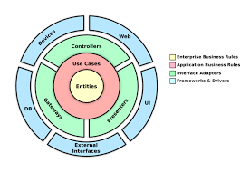

# pdm-assignment

## Introduction
- Per the requirement, I can only use either Go, Java, or C# to build the backend. I have never used any of this language to build a web server before. 
After doing researches on all three, I saw that C# is well-supported among the community and have good ecosystem. Although there is no deadline, I limited myself to only build this app
in about 1.5 week. After consideration, I decided to go with C# because it has all of the things that I need:
    - Has a lot of resources that I can used to learn it fast
    - The learning curve is not so steep because it's quite similar to Java (which I already knew and used non-professionally).
So that I can build the project in about 1 week.
    - Has a well-known and strong framework, ASP.NET, to build web server

## Pre-Installation
You have to install the dotnet SDK and React before running the project
####  Credentials to log in for the app
1. `tam@gmail.com` and password is `Pa$$w0rd`
2. `hubert@gmail.com` and password is `Pa$$w0rd`

## Installation
1. `cd client-app` and `npm run build`
2. `cd backend/API` and `dotnet watch run`
3. Open the browser to `http://localhost:5000/`
4. Use one of the credential above to log in (I don't have the log out component so the only way is to delete the `jwt` key in the `localStorage` and reload the page)

## Report

- Although I am familiar with the MVC, I decided to implement the `Clean architecture` for the backend. The reason is that I want to encapsulate each dependency in its own ring. It keeps the business logic and policy in the inner circles, separated from the outer rings which includes database, React, etc.
- For all the code that implement the CRUD operations to satisfy the `1.` and `2.` requirements, it can found in `backend/API/Controllers` and iin the `backend/Application/`
- To satisfy the search function `3.`, you have look at the logic in `backend/Application/Titles/Search.cs`
- The main table in the database is the Title (AKA books), which is the file `backend/Domain/Title.cs`. The table is also indexed by the book's name and price, which are two values that the book will be looked for.
- To allow the user to search with multiple attributes `4.`, you have look up book by its name and the maximum price for the result.
- The application can support multiple store owners at the same time and the data are segregated by its current user. 
The book that is `owned` by user `tam` will not be seen when user `hubert` log in and otherwise. 
- Before I also implemented the `distributed lock` with Redis. But after receiving your clarification on the last `bonus point`, I removed it since there is no point
of locking book when one its user can see and edit it.

## Analysis 
- Right now, the search query takes about 3s. The reason is because it has to check the linking table
for the book and its current user. Before, it only took less or about 1s. In the professional project, I think I can make it run faster
by sharding the database by its user.